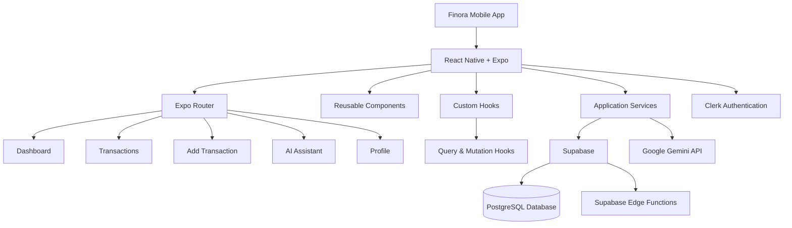
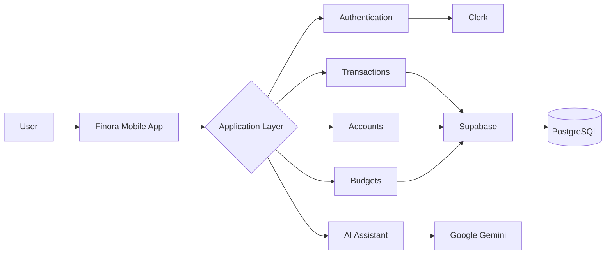
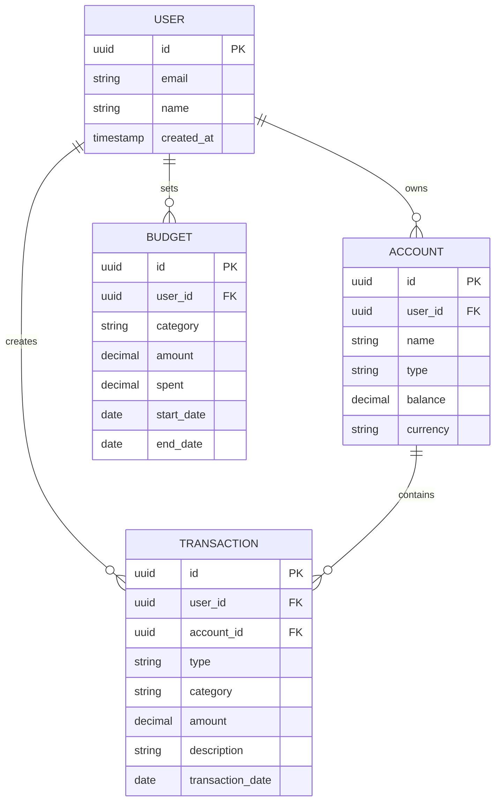

# Finora

**Finora** is an AI-powered personal finance mobile app built with React Native and Expo. It helps users track expenses, manage budgets, and get smart financial insights — all in one place.

## ✨ Features

* 🔐 Secure authentication with Clerk
* 💰 Expense & income tracking
* 📊 Visual spending insights and charts
* 🔔 Budget alerts and notifications
* 🤖 AI-powered financial tips using Google Gemini
* ☁️ Real-time data synchronization with Supabase
* 👤 User profile and account management
* 🧾 Transaction management and categorization
* 📤 Transaction export support

---

## 🏗️ Application Architecture

Finora follows a modular architecture where the mobile application communicates with authentication, database, backend services, and AI services.



### 🔄 Application Data Flow



---

## 🗄️ Database Design

Finora uses Supabase/PostgreSQL for storing financial data. The following ER diagram represents the core relationships between users, accounts, transactions, and budgets.



> **Note:** The ER diagram is a simplified representation of the application's core financial entities and is intended to explain the overall data relationships.

---

## 🛠️ Tech Stack

| Category             | Technology                     |
| -------------------- | ------------------------------ |
| **Frontend**         | React Native, Expo, TypeScript |
| **Styling**          | NativeWind / Tailwind CSS      |
| **Navigation**       | Expo Router                    |
| **Backend**          | Supabase                       |
| **Database**         | PostgreSQL                     |
| **Authentication**   | Clerk                          |
| **AI**               | Google Gemini API              |
| **State Management** | Zustand / Context              |
| **Data Fetching**    | Query & Mutation Hooks         |

---

## 🚀 Getting Started

### Prerequisites

Make sure you have the following installed:

* Node.js (v18+)
* npm or yarn
* Expo Go app for physical-device testing
* Android Studio or Xcode for simulator/emulator testing

### Installation

```bash
# Clone the repository
git clone https://github.com/chaitanyaphatak/finora-ai-finance-tracker-project.git

# Navigate to the project
cd finora-ai-finance-tracker-project

# Install dependencies
npm install
```

### 🔐 Environment Setup

Create a `.env` file in the root directory based on `.env.example`.

```env
CLERK_PUBLISHABLE_KEY=your_clerk_key
SUPABASE_URL=your_supabase_url
SUPABASE_ANON_KEY=your_supabase_anon_key
GEMINI_API_KEY=your_gemini_key
```

> ⚠️ Never commit your `.env` file or expose API keys publicly.

### ▶️ Run the App

Start the Expo development server:

```bash
npx expo start -c
```

Scan the QR code using the Expo Go app, or run the application on a simulator/emulator:

```bash
npx expo start --android
```

```bash
npx expo start --ios
```

---

## 📁 Project Structure

```text
finora-ai-finance-tracker-project/
│
├── app/                       # Screens and Expo Router navigation
│   ├── (auth)/                # Authentication screens
│   └── (root)/                # Main application screens
│       └── (tabs)/            # Main tab screens
│
├── components/                # Reusable UI components
│
├── constants/                 # Application-wide constants
│
├── hooks/                     # Custom React hooks
│   ├── mutations/             # Data mutation hooks
│   └── queries/               # Data query hooks
│
├── lib/                       # Core utilities, schemas and services
│   ├── query/                 # Query client and query keys
│   ├── schemas/               # Validation schemas
│   ├── services/              # Application services
│   └── utils/                 # Utility functions
│
├── store/                     # Application state management
│
├── supabase/                  # Supabase configuration and functions
│   └── functions/             # Supabase Edge Functions
│
├── types/                     # TypeScript type definitions
│
├── assets/                    # Images, fonts and application assets
│
├── README.md                  # Project documentation
└── package.json               # Dependencies and scripts
```

---

## 🤖 AI Features

Finora integrates Google Gemini to provide AI-powered financial assistance.

The AI assistant can be used to provide users with:

* 💡 Financial insights
* 📊 Spending-related suggestions
* 🤖 AI-powered assistance
* 🧠 Smart recommendations based on financial activity

The AI functionality is integrated with the application's service layer to keep AI-related logic separate from the UI.

---

## 💰 Core Financial Features

### Accounts

Users can manage their financial accounts and track account balances.

### Transactions

Users can:

* Add income and expenses
* Categorize transactions
* View transaction history
* Track spending activity
* Export transaction data

### Budgets

Users can create budgets and monitor their spending against defined limits.

### Dashboard

The dashboard provides an overview of:

* Current balance
* Budget progress
* Spending insights
* Recent transactions

---

## 🗺️ Roadmap

* [ ] Add more detailed analytics
* [ ] Improve multi-currency support
* [ ] Export reports as PDF/CSV
* [ ] Dark mode refinements
* [ ] Improve AI-powered financial insights
* [ ] Add more budgeting capabilities
* [ ] Improve transaction categorization

---

## 🤝 Contributing

**Finora is open for contributions!** 🚀

Contributions are welcome from developers who want to improve the project, fix bugs, add features, improve the UI, optimize performance, or improve documentation.

### How to Contribute

1. Fork the repository.
2. Clone your fork locally.

```bash
git clone https://github.com/your-username/finora-ai-finance-tracker-project.git
```

3. Create a new branch:

```bash
git checkout -b feature/your-feature-name
```

4. Make your changes.
5. Test your changes locally.
6. Commit your changes with a clear message:

```bash
git commit -m "Add your feature"
```

7. Push your branch:

```bash
git push origin feature/your-feature-name
```

8. Open a Pull Request against the `main` branch.

### Contribution Guidelines

Before opening a Pull Request:

* Keep changes focused and relevant.
* Follow the existing project structure.
* Follow the existing coding style.
* Test your changes before submitting.
* Do not commit API keys, secrets, or `.env` files.
* Update documentation when required.
* Write a clear Pull Request description.
* Avoid unnecessary breaking changes.

### 💡 Found a Bug or Have an Idea?

Feel free to open an issue describing:

* The problem or bug
* Steps to reproduce it
* Expected behavior
* Actual behavior
* Suggested improvement, if applicable

Every contribution — from fixing a typo to adding a major feature — is appreciated. ❤️

---

## 📄 License

This project is currently intended for **personal and portfolio use**. Contributions are welcome, but the project does not currently provide a separate open-source license.

---

## ❤️ Acknowledgements

Finora is built using modern open-source technologies and libraries including React Native, Expo, Supabase, Clerk, NativeWind, and other community-driven tools.

---

**Built with ❤️ using React Native & Expo.**
